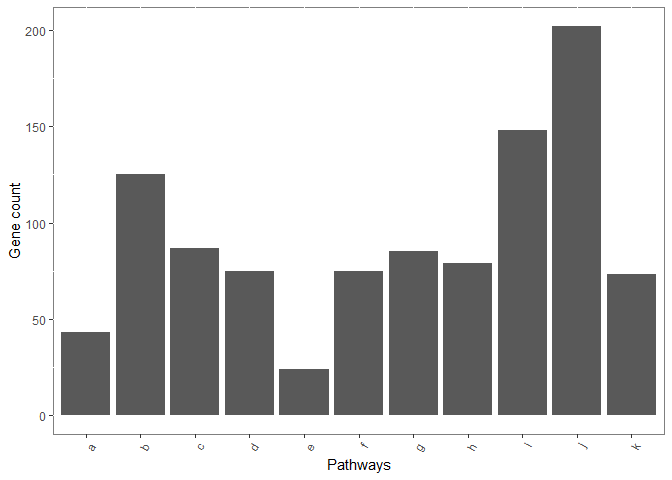
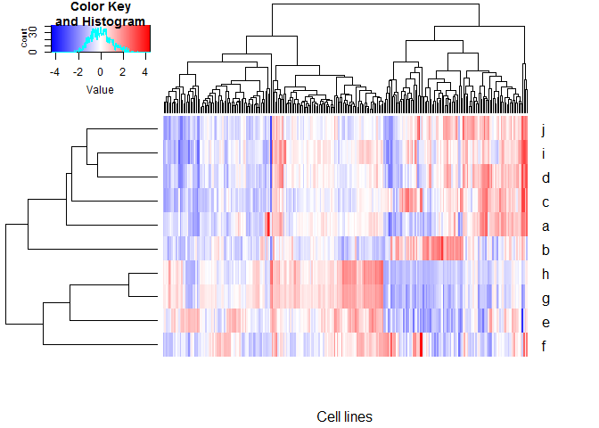

Picking CCLE cell lines for pathway analysis
================

This is for an R01 application. We want to study cellular signaling using proteomics. The idea is that current knowledge about signaling is very fuzzy, due to the overlap of signaling components between pathways, e.g. both EGFR and FGFR signal through the MAPK signaling cascade.

We were criticized about how model CCLE cell lines are picked for the study. So I want to see whether I can find a way to choose the cell lines based on the gene expression level of the pathway components.

The read count RNA-seq data are downloaded from the CCLE. The data will have to be normalized before use. To do so, DESeq2 will be used.

``` r
# import the raw count data, there are two rows of unwanted materials, so I will have to skip it
raw.counts <- read.delim("../../CCLE_DepMap_18Q2_RNAseq_reads_20180502.gct",
                         header = TRUE, stringsAsFactors = FALSE,
                         skip = 2)
raw.counts[1:5, 1:5]
```

    ##                Name Description X22RV1_PROSTATE X2313287_STOMACH
    ## 1 ENSG00000223972.4     DDX11L1               0                2
    ## 2 ENSG00000227232.4      WASH7P            2316             1538
    ## 3 ENSG00000243485.2  MIR1302-11               5                1
    ## 4 ENSG00000237613.2     FAM138A               0                1
    ## 5 ENSG00000268020.2      OR4G4P               0                0
    ##   X253JBV_URINARY_TRACT
    ## 1                     0
    ## 2                  1094
    ## 3                    19
    ## 4                    30
    ## 5                     3

DESeq2 requires a matrix with the gene name as row names, the count matrix; and a separated matrix for annotation containing the column names (which is the cell lines in this case).

The count matrix,

``` r
# DESeq2 normalization.

# make the count data matrix
count.data <- as.matrix(raw.counts[, 3:1078])
row.names(count.data) <- raw.counts$Name         # the row names are the Ensembl IDs
count.data[1:5, 1:5]
```

    ##                   X22RV1_PROSTATE X2313287_STOMACH X253JBV_URINARY_TRACT
    ## ENSG00000223972.4               0                2                     0
    ## ENSG00000227232.4            2316             1538                  1094
    ## ENSG00000243485.2               5                1                    19
    ## ENSG00000237613.2               0                1                    30
    ## ENSG00000268020.2               0                0                     3
    ##                   X253J_URINARY_TRACT X42MGBA_CENTRAL_NERVOUS_SYSTEM
    ## ENSG00000223972.4                   4                              0
    ## ENSG00000227232.4                1148                           1367
    ## ENSG00000243485.2                  26                             10
    ## ENSG00000237613.2                  22                              0
    ## ENSG00000268020.2                   4                              0

``` r
# annotation matrix, this contain a single column named condition, which is the name of the cell lines
```

And the annotation matrix,

``` r
coldata <- as.matrix(data.frame(condition = names(raw.counts[, 3:1078]))) 
row.names(coldata) <- names(raw.counts[, 3:1078])   # also make the cell lines as the col.names
head(coldata, 3)
```

    ##                       condition              
    ## X22RV1_PROSTATE       "X22RV1_PROSTATE"      
    ## X2313287_STOMACH      "X2313287_STOMACH"     
    ## X253JBV_URINARY_TRACT "X253JBV_URINARY_TRACT"

``` r
# create the DESeq object
dds <- DESeqDataSetFromMatrix(countData = count.data,
                              colData = coldata,
                              design = ~condition) # design is just the condition in this case
```

    ## converting counts to integer mode

``` r
# then create the normalization factor using estimateSizeFactors()
dds <- estimateSizeFactors(dds)

# retrieve the normalized count using counts(, normalized = TRUE)
nor.CCLE <- raw.counts[, 1:2]
colnames(nor.CCLE) <- c("Ensembl", "Gene.names")
nor.CCLE <- cbind(nor.CCLE, data.frame(counts(dds, normalized = TRUE), stringsAsFactors = FALSE), row.names = NULL)
```

The normalized read counts,

``` r
nor.CCLE[1:5,1:5]
```

    ##             Ensembl Gene.names X22RV1_PROSTATE X2313287_STOMACH
    ## 1 ENSG00000223972.4    DDX11L1         0.00000         2.085369
    ## 2 ENSG00000227232.4     WASH7P      1753.92512      1603.648846
    ## 3 ENSG00000243485.2 MIR1302-11         3.78654         1.042685
    ## 4 ENSG00000237613.2    FAM138A         0.00000         1.042685
    ## 5 ENSG00000268020.2     OR4G4P         0.00000         0.000000
    ##   X253JBV_URINARY_TRACT
    ## 1               0.00000
    ## 2            1014.67418
    ## 3              17.62231
    ## 4              27.82470
    ## 5               2.78247

Using the EGFR pathway as an example, I want to see what algorithm will provide the most obvious choice cell lines with a high expression of the gene members of a particular pathway. The data of pathway members are be downloaded from reactome.org as .tsv. And I want to try the 1) rank sum, 2) mean, 3) median and the 4) sum of gene expression.

``` r
# import the EGFR pathway data and extract the member genes
egfr <- read.delim("../../signaling_genes/by_EGFR.tsv", 
                   header = TRUE, stringsAsFactors = FALSE)
egfr <- egfr %>% separate(MoleculeName, into = c("Molecule" , "Gene.name"), sep = " ") %>%
  filter(MoleculeType == "Proteins")
egfr <- egfr$Gene.name[!duplicated(egfr$Gene.name)]
```

``` r
# Testing which method is best for separating the cell lines
# copy the df into a new df, so the original will not be modified
rank.expression <- nor.CCLE
# Computing the rank sum:
# Rank order all of the gene expressions, producing a matrix
rank.expression <- apply(rank.expression[, 3:1078], 2, 
                         FUN = rank, ties.method = "min")
# add the Ensembl IDs and gene names back to the matrix, produce a df
rank.expression <- cbind(nor.CCLE[, 1:2], rank.expression)
# then select genes that are only in the egfr pathway
egfr.rank <- rank.expression[rank.expression$Gene.names %in% egfr, ]
# add up the rank of the egfr pathway components 
egfr.matrix <- data.frame(Ensembl = rank.expression$Ensembl, stringsAsFactors = FALSE)
egfr.matrix <- data.frame(Rank.sum = colSums(egfr.rank[, 3:1078]), stringsAsFactors = FALSE)

# Median, mean and sum
# make a df containig the normalized expression of egfr components
egfr.ccle <- nor.CCLE[nor.CCLE$Gene.names %in% egfr, ]

egfr.matrix$Median <- robustbase::colMedians(as.matrix(egfr.ccle[, 3:1078]))
egfr.matrix$Mean <- colMeans(as.matrix(egfr.ccle[, 3:1078]))
egfr.matrix$Sum <- colSums(as.matrix(egfr.ccle[, 3:1078]))
```

``` r
egfr.matrix$Cell.lines <- row.names(egfr.matrix)
egfr.matrix.long <- egfr.matrix %>% gather(key = "Methods", value = "Expressions", 1:4)

ggplot(egfr.matrix.long) +
  geom_point(mapping = aes(x = Cell.lines, y = Expressions)) +
  facet_wrap(~ Methods, scales = "free_y")
```


Based on the plots, mean and sum seem to give the best separation (they are basically the same). By comparing mean and sum to rank sum and median, it also indicates that the outlier cell lines have certain highly expressed genes within the pathway, but not the over-expression of all of the pathway component annotated by reactome.org. I don't think this will adversely affect the choice of cell lines. Because in the end, we want to see the over-activated and to find out the best marker(s) for a particular pathway.

The outlier cell lines will be selected as demonstrated in the following plot.

``` r
cut.off <- quantile(egfr.matrix$Sum, 0.75) + 1.5 * IQR(egfr.matrix$Sum)
egfr.matrix$x.axis <- 1:nrow(egfr.matrix)
egfr.matrix$Picked <- egfr.matrix$Sum >= cut.off
scatter.plot <- ggscatter(egfr.matrix, 
                          x = "x.axis", y = "Sum", 
                          color = "Picked", palette = c("Grey", "Red"),
                          xlab = "Cell lines", 
                          ylab = "Sum expression of EGFR pathway components")

box <- ggboxplot(egfr.matrix, x = 1, y = "Sum", 
                 alpha = 0.5, 
                 fill = "grey") + clean_theme()

combined.plot <- ggarrange(scatter.plot, box,
          ncol = 2, align = "h",
          widths = c(9, 1), heights = c(1,1),
          common.legend = TRUE)

combined.plot
```


With the method figured out, I downloaded the data of 11 signaling pathways that we will propose to study from the reactome.org.

``` r
# Reading and cleaning up of the reactome files
# read the files containing the signaling components into a list
signaling.files <- list.files(path = "../../signaling_genes", pattern = "by_",
                              full.names = TRUE)            # full name extract the path
# use the file list created above to read the files into a list of df
# this dfs contain the data from reactome, which have to clean up further to extract the genes
gene.list <- lapply(signaling.files, read.delim, header = TRUE, stringsAsFactors = FALSE)
# extract the pathway names from the file list
pathway.names <- lapply(signaling.files, str_sub, 26, -5)
# add pathway names back to the file list
names(gene.list) <- pathway.names

# the reactome data actually contains a lot of information, which I don't need, 
# so write a function and clean all of them up with lapply()
extract.genes <- function(x, MoleculeType, MoleculeName) {
  x <- x %>% 
    filter(MoleculeType == "Proteins") %>% 
    separate(MoleculeName, into = c("Uniprot", "Gene.names"), sep = " ")
  x <- x[!duplicated(x$Gene.names), ]
  x <- x$Gene.names
}

# clean up the gene list with the new function
gene.list <- lapply(gene.list, FUN = extract.genes)
names(gene.list) <- str_c("Reactome.", letters[1:length(names(gene.list))])
```

There are 1016 genes or 736 unique genes in total. The smallest pathway contains 24 genes and 202 for the largest.

``` r
gene.list.long <- list2df(gene.list)
names(gene.list.long)[1:2] <- c("Gene.names", "Pathways")
gene.list.long <- gene.list.long %>% separate(Pathways, into = c("Sources", "Pathways"), sep = "\\.")

ggplot(gene.list.long) +
  geom_bar(mapping = aes(x = Pathways)) +
  #facet_wrap(~ Sources) +
  theme(axis.text.x = element_text(angle = 60, hjust = 1),
        panel.background = element_rect(fill = "white", colour = "grey50")) +
  ylab("Gene count")
```



``` r
# create a new list to whole the list of df with pathway component expression values
ccle.pathways <- list()

# match the whole CCLE expression data with the list containing pathway components
# then add Ensembl IDs as the gene names
for (i in 1:length(gene.list)) {
  ccle.pathways[[i]] <- nor.CCLE[nor.CCLE$Gene.names %in% gene.list[[i]],]
  row.names(ccle.pathways[[i]]) <- ccle.pathways[[i]][,1]
}

# rename of the dfs in the list with each respective signaling pathway
names(ccle.pathways) <- names(gene.list)

# remove the columns containing Ensembl IDs and gene names, so that I can do calculations
ccle.pathways <- lapply(ccle.pathways, FUN = select, 3:1078)

# calculate the sums of expression of pathway component in each cell lines
sum.gene.expression <- lapply(ccle.pathways, function(x) data.frame(Sums = colSums(x)))

# convert the sum of expression list into a wide DF
cell.pathway.sum <- Reduce(f = function(x, y) cbind(x, y),
                           x = sum.gene.expression)
colnames(cell.pathway.sum) <- names(sum.gene.expression)
cell.pathway.sum$Cells <- rownames(cell.pathway.sum)
```

And there are 259 cell lines from 23 tissue types. The number of cell lines for each tissue type range from 3 and 4 for AUTONOMIC\_GANGLIA and PROSTATE, respectively to 130 cell lines from fibroblast. 

The pathways that can be studied in each tissue type are also different. Interestingly, HAEMATOPOIETIC\_AND\_LYMPHOID\_TISSUE has all of the 11 pathways.


It is probably easier to pick cells after clustering, e.g. pathway h and pathway g are probably more active in the same cluster of cells.

``` r
# log2 transform the expression
log.sum <- cells.list.sum %>% 
  separate(col = Cells, into = c("Cells", "Tissues"), sep = "_", extra = "merge")
log.sum[, 3:13] <- apply(log.sum[, 3:13], 2, log2)
# normalize each pathway
log.sum[, 3:13] <- apply(log.sum[, 3:13], 2, scale)
colnames(log.sum)[3:13] <- letters[1:11]

heatmap.2(t(log.sum[,3:12]), 
          col = rev(redblue(300)),
          trace = "none",
          labCol = NA,
          xlab = "Cell lines")
```


